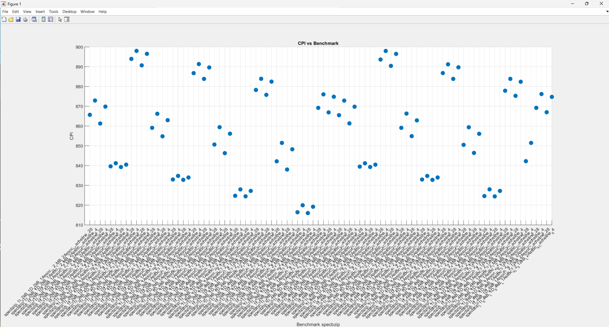
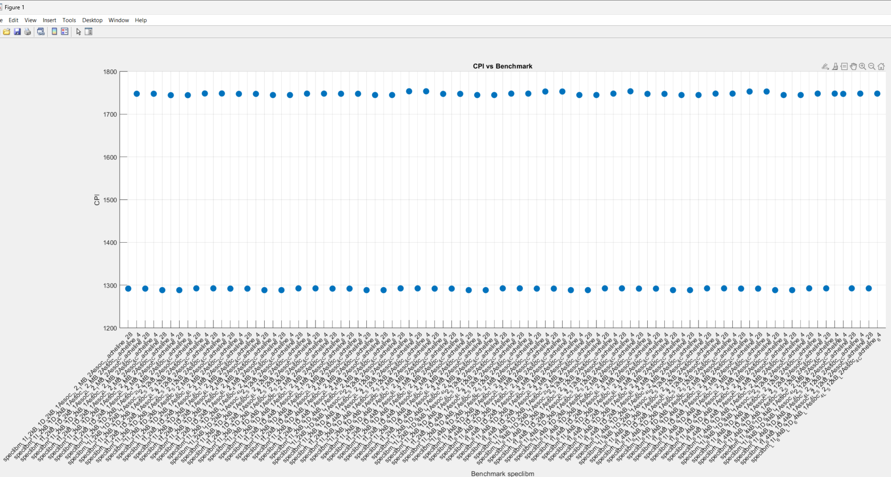
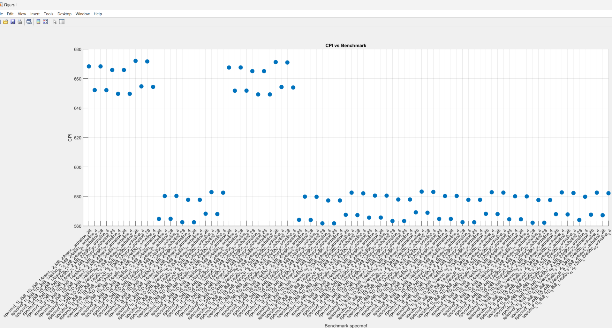
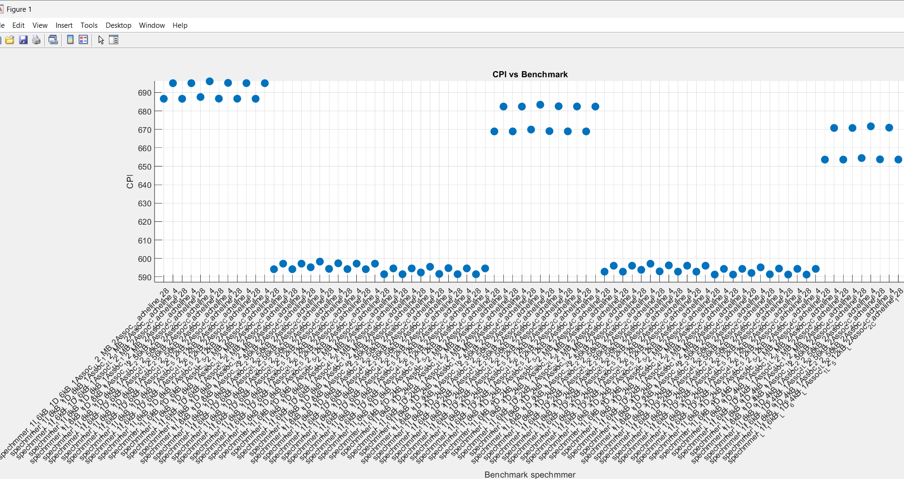
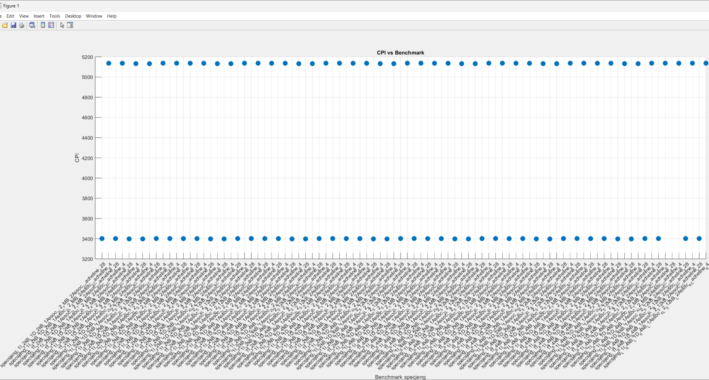
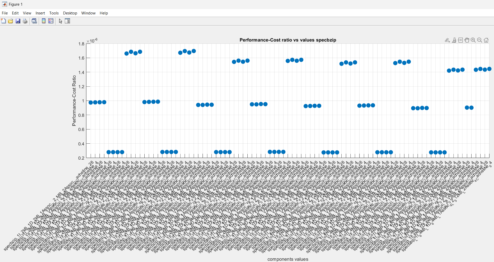
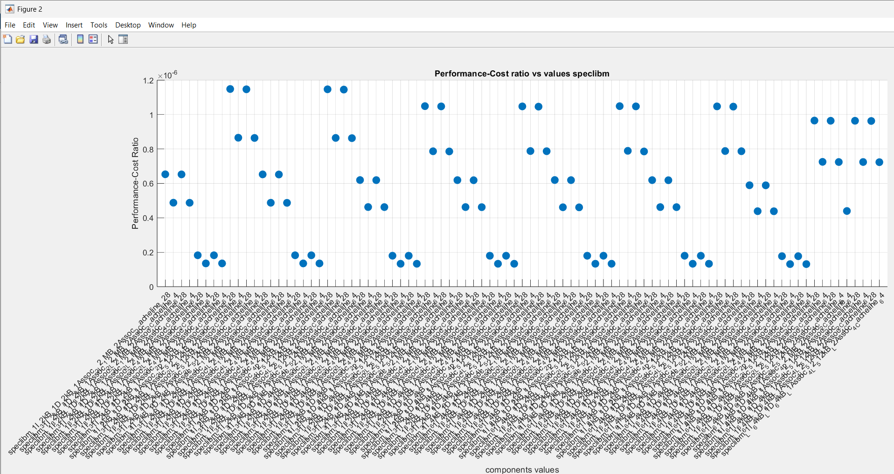
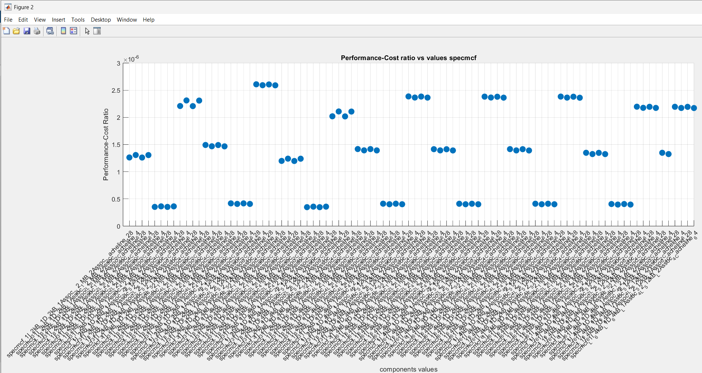
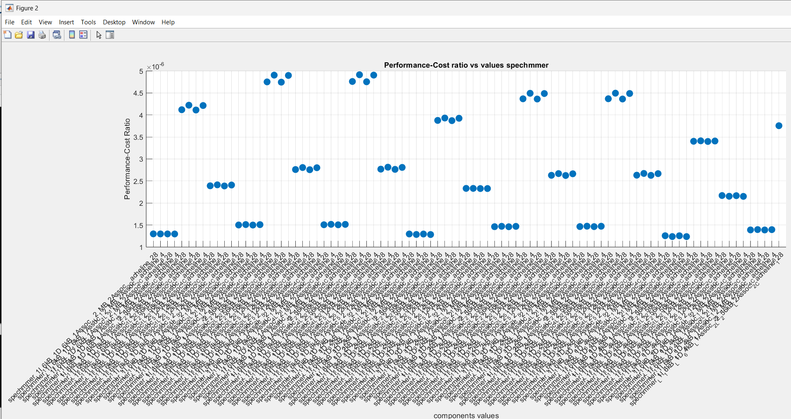
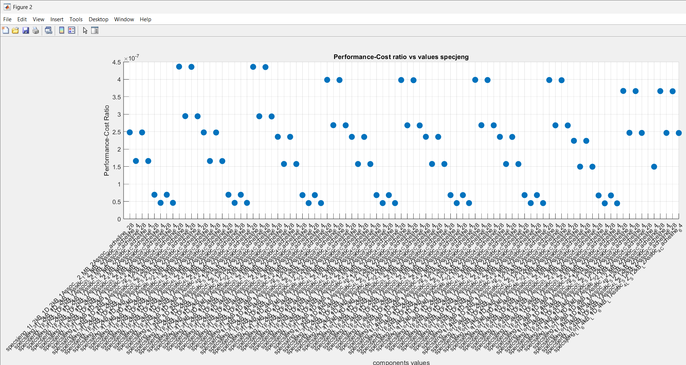

# Αναφορά Εργασίας Αρχιτεκτονικής Υπολογιστών

**Δημήτριος Ορέστης Βαγενάς | AEM: 10595**

---

# Εισαγωγή

Η παρούσα εργασία αφορά τη σχεδίαση, την ανάλυση και τη βελτιστοποίηση ενός συστήματος αρχιτεκτονικής επεξεργαστών, εστιάζοντας στη χρήση του **gem5** για την εκτέλεση benchmarks και την αξιολόγηση διαφορετικών παραμέτρων του συστήματος.

## Περιεχόμενα

### 1. images
Περιλαμβάνονται φωτογραφίες από τα αποτελέσματα και τις αναλύσεις που πραγματοποιήθηκαν κατά τα βήματα 2 και 3 της εργασίας.

### 2. Scripts
Όλα τα scripts που χρησιμοποιήθηκαν για την ανάλυση και επεξεργασία των δεδομένων βρίσκονται οργανωμένα στον αντίστοιχο φάκελο `scripts`.

### 3. Κώδικες MATLAB
Οι κώδικες MATLAB που αναπτύχθηκαν για την ανάλυση δεδομένων και τη δημιουργία γραφημάτων βρίσκονται επίσης στον φάκελο `matlab`, οργανωμένοι σύμφωνα με το βήμα της εργασίας.

### 4. Αρχεία εξόδου
- **Πρώτο μέρος, Δέυτερο μέρος Βήμα 1**  
  Για το πρώτο βήμα της εργασίας, τα αρχεία εξόδου είναι αποθηκευμένα και οργανωμένα σε δύο μέρη (`step 1` και `step 2`) στους αντίστοιχους φακέλους.

- **Δεύτερο μέρος Βήματα 2 και 3**  
  Τα αρχεία εξόδου από τα βήματα 2 και 3 είναι αποθηκευμένα σε μορφή Excel και βρίσκονται στον φάκελο excel.

---

## Ερωτήματα Πρώτου Μέρους

### 1. Κατά το άνοιγμα του starter_se.py παρατηρούμε ότι:
- Οι βασικοί παράμετροι και χαρακτηριστικά είναι:
  - **Τύπος CPU** (`--cpu`): Ορίζεται από την παράμετρο `cpu_types` και περιλαμβάνει τους τύπους:
    - `atomic`: Χρησιμοποιεί το `AtomicSimpleCPU`.
    - `minor`: Χρησιμοποιεί το `MinorCPU` με L1 Instruction Cache, L1 Data Cache, και L2 Cache.
    - `hpi`: Χρησιμοποιεί τον `HPI CPU` με αντίστοιχα caches.
  - **Συχνότητα CPU** (`--cpu-freq`): Ορίζεται μέσω της παραμέτρου `cpu_freq` στην κλήση του `cpu_cluster`, με προεπιλογή 1GHz.
  - **Αριθμός πυρήνων CPU** (`--num-cores`): Ορίζεται μέσω της παραμέτρου `num_cores`, με προεπιλογή 1 πυρήνα.
  - **Τύπος μνήμης** (`--mem-type`): Ορίζεται από την παράμετρο `mem_type`, με προεπιλεγμένη τιμή `DDR3_1600_8x8`.
  - **Αριθμός καναλιών μνήμης** (`--mem-channels`): Δύο κανάλια.
  - **Ranks ανά κανάλι** (`--mem-ranks`): Ορίζεται μέσω της παραμέτρου `mem_ranks`.
  - **Μέγεθος μνήμης** (`--mem-size`): 2GB.
  - **Voltage**: 3.3V.
  - **Clock Domain**: 1GHz.

### 2. Παρατηρήσεις από τα αρχεία config.ini και config.json
#### (A) Χαρακτηριστικά:
- **CPU**: MinorCPU (ενότητα `system.cpu_cluster.spus`).
- **Συχνότητα λειτουργίας**: 1GHz (ενότητα `system.cpu_cluster.clk_domain.clock`).
- **Caches**:
  - L1 Instruction Cache: 48KB, Associativity 3, Latency 1.
  - L1 Data Cache: 32KB, Associativity 2, Latency 2.
  - L2 Cache: 1MB, Associativity 16, Latency 12.
- **Μνήμη**:
  - Μέγεθος: 2GB (διευθύνσεις από `0` έως `2^31 - 1`).
  - Τύπος: DDR3_1600_8x8.

#### (B) Ορισμοί:
- **sim_seconds**: Αντιπροσωπεύει τον χρόνο που έχει περάσει στην προσομοίωση, σε δευτερόλεπτα.
- **sim_insts**: Αριθμός εντολών που εκτελέστηκαν κατά τη διάρκεια της προσομοίωσης.
- **host_inst_rate**: Ρυθμός εκτέλεσης εντολών στον ξενιστή (host machine), εκφραζόμενος ως αριθμός εντολών ανά δευτερόλεπτο.

#### (C) Παρατηρήσεις από το αρχείο stat.txt:
- Αριθμός `committed` εντολών: 5027.
- Λόγοι διαφορών:
  - Απορρίψεις εντολών λόγω διακοπών ή αναμονής: 1300.
  - Μικροεντολές (micro-ops) από διάσπαση πολύπλοκων εντολών: 5831.

#### (D) Προσπελάσεις L2 Cache:
- Σύνολο προσπελάσεων: 474 (ενότητα `system.cpu_cluster.l2.overall_access::total`).
- Αν δεν έχουμε αυτά τα δεδομένα, οι προσπελάσεις θα μπορούσαν να υπολογιστούν θεωρητικά, με βάση τις προσπελάσεις μνήμης δηλαδή αν γνωρίζουμε τον αριθμό των εντολών και τον ρυθμό πρόσβασης στη μνήμη ανά εντολή, μπορούμε να εκτιμήσουμε πόσες προσπελάσεις έγιναν ή απο τα Miss rate, hit rate καθώς αν έχουμε δεδομένα για το ποσοστό επιτυχιών (hits) και αποτυχιών (misses) από την L1 cache, μπορούμε να υπολογίσουμε τις προσπελάσεις στη L2 οτί είναι ίσες με της αστοχοιές της L1. 

### 3. Σύγκριση CPU Μοντέλων
- **SimpleCPU**: Το πιο βασικό μοντέλο επεξεργαστή στον gem5.
  - Χαρακτηριστικά:
    - Δεν περιλαμβάνει pipeline.
    - Εκτελεί μία εντολή τη φορά.
    - Χρησιμοποιείται για γρήγορη εξομοίωση συστημάτων, με περιορισμένη ακρίβεια.
- **O3CPU** (Out-of-Order CPU):
  - Υποστηρίζει out-of-order και in-order εκτέλεση.
  - Περιλαμβάνει πλήρες pipeline.
  - Ιδανικό για αναλυτικές εξομοιώσεις με έμφαση σε speculation και branch prediction.
- **TraceCPU**:
  - Χρησιμοποιεί προεπεξεργασμένα ίχνη εκτέλεσης (execution traces).
  - Αναπαράγει τη συμπεριφορά του συστήματος χρησιμοποιώντας δεδομένα που έχουν συλλεχθεί προηγουμένως.
  - Ιδανικό για ταχύτητα, χωρίς ανάλυση υψηλής ακρίβειας.
- **MinorCPU**:
  - Λεπτομερές μοντέλο in-order με pipeline τεσσάρων σταδίων (fetch, decode, execute, commit).
  - Προσφέρει έναν συμβιβασμό μεταξύ της ακρίβειας του O3CPU και της ταχύτητας του SimpleCPU.
  - Υποστηρίζει pipeline hazards, καθυστερήσεις μνήμης, και branch prediction.


## Ερωτήματα Δεύτερου Μέρους

### Βήμα 1: Benchmark `specbzip`

1. Παρατηρούμε από το αρχείο εξόδου `.json` από το benchmark `specbzip` ότι έχουμε τις τιμές:
   - **Cache Line Size**: 64.
   - **L1 (Instruction Cache) Size**: 32768, **Associativity**: 2.
   - **L1 (Data Cache) Size**: 65536, **Associativity**: 2.
   - **L2 Cache Size**: 2097152, **Associativity**: 8.

2. Μετά από καταγραφή των απαιτούμενων δεδομένων καταλήξαμε στα εξής (το CPI υπολογίζεται ως `sims_ticks / sims_inst`, δηλαδή `total cycles / total instructions`):

   - **SPECBZIP**:
     - Χρόνος εκτέλεσης: 0.083982.
     - CPI: 839.82.
     - L1 Instruction Cache Miss Rate: 0.000077.
     - L1 Data Cache Miss Rate: 0.014798.
     - L2 Miss Rate: 0.282163.

   - **SPECHMMER**:
     - Χρόνος εκτέλεσης: 0.029396.
     - CPI: 593.95.
     - L1 Instruction Cache Miss Rate: 0.000221.
     - L1 Data Cache Miss Rate: 0.001637.
     - L2 Miss Rate: 0.07776.

   - **SPECLIBM**:
     - Χρόνος εκτέλεσης: 0.174671.
     - CPI: 1746.7.
     - L1 Instruction Cache Miss Rate: 0.000094.
     - L1 Data Cache Miss Rate: 0.060972.
     - L2 Miss Rate: 0.999944.

   - **SPECMCF**:
     - Χρόνος εκτέλεσης: 0.064955.
     - CPI: 649.54.
     - L1 Instruction Cache Miss Rate: 0.023612.
     - L1 Data Cache Miss Rate: 0.002108.
     - L2 Miss Rate: 0.055046.

   - **SPECJENG**:
     - Χρόνος εκτέλεσης: 0.513528.
     - CPI: 5135.27.
     - L1 Instruction Cache Miss Rate: 0.00002.
     - L1 Data Cache Miss Rate: 0.121831.
     - L2 Miss Rate: 0.999972.

3. Το `system.clk_domain.clock` αναφέρεται στο γενικό ρολόι του συστήματος (συχνά χρησιμοποιείται για το υπόλοιπο σύστημα πέρα από την CPU, π.χ. μνήμες, διαύλους), ενώ το `system.cpu_clk_domain.clock` αναφέρεται στην περίοδο του ρολογιού που έχει ρυθμιστεί για την CPU. Η παράμετρος `–cpu-clock` επηρεάζει αυτή την τιμή.

   Όταν τρέχουμε με `–cpu-clock = 1GHz` ή `–cpu-clock = 3GHz`, η τιμή του `system.cpu_clk_domain.clock` αλλάζει αντίστοιχα. Η προεπιλεγμένη τιμή του ρολογιού της CPU εξαρτάται από την προκαθορισμένη ρύθμιση του gem5 και είναι 1GHz (`system.clk_domain.clock`).

   Από το αρχείο `.json` βλέπουμε τις περιόδους:
   ```json
   "clk_domain": {
       "name": "clk_domain",
       "clock": [1000]
   },
   "cpu_clk_domain": {
       "name": "cpu_clk_domain",
       "clock": [1000]
   }
   ```

   Όταν προστίθεται ένας νέος επεξεργαστής, ο νέος επεξεργαστής θα μοιραστεί την ίδια συχνότητα ρολογιού με το υπόλοιπο CPU στο οποίο ανήκει. Εάν δεν οριστεί διαφορετική συχνότητα, ο gem5 θα χρησιμοποιήσει τη συχνότητα που ορίζεται μέσω της παραμέτρου `system.cpu_clk_domain.clock`.

   Όσον αφορά το scaling, το τέλειο scaling θα σήμαινε ότι ο χρόνος εκτέλεσης μειώνεται ανάλογα με την αύξηση της συχνότητας. Από την παράμετρο `sim_seconds` βλέπουμε ότι στη συχνότητα 1GHz είναι 0.161025, ενώ στα 3GHz είναι 0.058385. Αυτό δεν είναι γραμμικό. Ορισμένοι λόγοι που μπορεί να συμβαίνει αυτό περιλαμβάνουν:
   - Dependencies μεταξύ εντολών (ορισμένες εντολές περιμένουν δεδομένα από προηγούμενες).
   - Αργές μνήμες (η πρόσβαση στη μνήμη δεν επηρεάζεται σημαντικά από τη συχνότητα της CPU).

4. Για το benchmark specbzip, από το αρχείο stats.txt έχουμε το ίδιο cpu clock frequency στα 2GHz. Για να εξετάσω τις διαφορές παρατήρησα πρώτον ότι το sims_seconds μειώνεται με την χρήση του ddr3_2133 σε 0.083609 από 0.083982 του ddr3_1600, η οποία είναι μικρή (0.45%) αλλά είναι μια μείωση. Επίσης υπολόγισα το CPI για κάθε περίπτωση με την σχέση που ανέφερα προηγουμένος και υπολογίστηκαν σε 836.087 για τον drd3_2133 και 839.825 για τον ddr3_1600 που επιβεβαιώνει τη βελτίωση στην απόδοση του συστήματος.

## Ερωτήματα Δεύτερου Μέρους

### Βήμα 2: Παραμετροποίηση

#### Χώρος των Πιθανών Συνδυασμών Παραμέτρων
Ο χώρος των πιθανών συνδυασμών παραμέτρων για το υποσύστημα μνήμης (π.χ., L1 και L2 cache sizes, associativity, cacheline size) είναι τεράστιος. Η πλήρης εξερεύνηση όλων των πιθανών παραμέτρων παρέχει πλήρη κάλυψη του χώρου δοκιμών, αλλά απαιτεί πολύ χρόνο και υπολογιστικούς πόρους. Προσωπικά, δοκίμασα πολλούς τρόπους και δεν περιόρισα τόσο πολύ τις παραμέτρους για να δημιουργήσω μια πιο ολοκληρωμένη εικόνα (σε αυτό το σημείο θα ήθελα να αναφέρω ότι το script που έτρεξα λειτουργούσε για 4 ημέρες και δημιούργησε 90 περιπτώσεις για κάθε benchmark, ωστόσο θεώρησα ότι ήταν αρκετές και το σταμάτησα. Αν το άφηνα να τρέξει έως το τέλος του θα είχα 325 διαφορετικές περιπτώσεις, που θεωρώ ότι είναι πάρα πολλές για τα πλαίσια αυτής της εργασίας).

Να αναφέρω επίσης ότι για το benchmark `spechmmer`, την πρώτη φορά που το έτρεξα, εκτελούσε μόνο 6000 instructions. Μετά από κάποιο καιρό που το ξανά έτρεξα, λειτούργησε κανονικά, και αυτός είναι ο λόγος που υπάρχουν διαφορετικά scripts για το benchmark αυτό.

#### Στρατηγικές Μείωσης Δοκιμών
Για να περιορίσουμε τις δοκιμές, μπορούμε να χρησιμοποίησουμε τις εξής στρατηγικές:

1. **Ανάλυση χαρακτηριστικών κάθε benchmark**:
   - **Specbzip**: Είναι ευαίσθητο στη συμπίεση δεδομένων και επωφελείται από μεγαλύτερα cache sizes (L1 dataκαθώς απαιτεί μεγάλη πρόσβαση σε δεδομένα, L1 associativity για μικροτέρο miss rate).
   - **Spechmmer**: Έχει έντονη εξάρτηση από μαθηματικούς υπολογισμούς, οπότε οι ενδιάμεσες τιμές associativity είναι αρκετές (L1D, L2 επειδή επεξεργάζεται μεγάλες ποσότητες δεοδομένων).
   - **Specmcf**: Έχει έντονη εξάρτηση από μαθηματικούς υπολογισμούς, οπότε οι ενδιάμεσες τιμές associativity είναι αρκετές (L1D λόγω μεγάλων ποσοτήτων δεδομένων, L2 associativity λόγο των συχνών προσπελάσεων δεδομένων από την L2 cache).
   - **Speclibm**: Εστιάζει σε floating-point υπολογισμούς, άρα ο συνδυασμός μικρών και μεγάλων L1 sizes μπορεί να αποκαλύψει το ιδανικό configuration (data cacheline διότι μειώνει την καθυστέρηση στην πρόσβαση δεδομένων).
   - **Specjeng**: Εστιάζει σε floating-point υπολογισμούς, άρα ο συνδυασμός μικρών και μεγάλων L1 sizes μπορεί να αποκαλύψει το ιδανικό configuration (L1D λόγω τον συχνών προσπελάσεων στην μνήμη, clc frequency καθώς η εκτέλεση εφαρμογών Java εξαρτάται από τη συχνότητα του επεξεργαστή).

2. **Εξέταση Οριακών Τιμών**: Εξέτασα ακραίες τιμές για διάφορες παραμέτρους.

3. **Εξαγωγή Συμπερασμάτων από Δοκιμές**: Εάν οι αλλαγές σε συγκεκριμένες παραμέτρους δεν είχαν σημαντική επίδραση στην απόδοση, μείωνα τις δοκιμές.

#### Παρατηρήσεις Γραφημάτων
Τα γραφήματα παρουσιάζουν στον κάθετο άξονα την τιμή του CPI και στον οριζόντιο την ονομασία του benchmark με τις τιμές των παραμέτρων.

---

#### Γραφήματα
Τα παρακάτω γραφήματα δείχνουν τη συσχέτιση μεταξύ του CPI και των παραμέτρων.

- **Γράφημα 1:** CPI benchmark specbzip .
- **Γράφημα 2:** CPI benchmark speclibm.
- **Γράφημα 3:** CPI benchmark specmcf.
- **Γράφημα 4:** CPI benchmark spechmmer.
- **Γράφημα 5:** CPI benchmark specjeng.









---

#### Συμπεράσματα
1. **Μέγεθος L1 Cache:** Η αύξηση του μεγέθους μειώνει το CPI έως ένα σημείο, αλλά το όφελος μειώνεται όσο αυξάνεται περισσότερο.
2. **Associativity:** Το αυξημένο associativity μειώνει τα conflict misses, αλλά πέρα από ένα επίπεδο η βελτίωση δεν είναι γραμμική.
3. **Cache Line Size:** Μεγαλύτερα cache lines είναι ευεργετικά για προγράμματα με υψηλή χωρική τοπικότητα, αλλά μπορεί να αυξήσουν το κόστος της μνήμης.

#### Πίνακας Αποτελεσμάτων

Yπάρχουν συνολικά 4 αρχεία excel στο repository, ένα για κάθε benchmark. Ο παρακάτω πίνακας παρουσιάζει κάποια από τα αποτελέσματα του benchmark specbzip. :

| Benchmark                                   | CPI        |
|--------------------------------------------|------------|
| specbzip_L1I_32kB_L1D_32kB_L1Assoc_2_L2_1MB_L2Assoc_2_Cacheline_128 | 865.6553   |
| specbzip_L1I_32kB_L1D_64kB_L1Assoc_2_L2_4MB_L2Assoc_4_Cacheline_128 | 824.4533   |
| specbzip_L1I_64kB_L1D_32kB_L1Assoc_4_L2_1MB_L2Assoc_2_Cacheline_64  | 866.287    |
| specbzip_L1I_32kB_L1D_32kB_L1Assoc_2_L2_1MB_L2Assoc_2_Cacheline_64  | 872.8907   |
| specbzip_L1I_32kB_L1D_64kB_L1Assoc_2_L2_4MB_L2Assoc_4_Cacheline_64  | 827.1862   |
| specbzip_L1I_64kB_L1D_32kB_L1Assoc_4_L2_4MB_L2Assoc_2_Cacheline_128 | 854.8728   |
| specbzip_L1I_32kB_L1D_32kB_L1Assoc_2_L2_1MB_L2Assoc_4_Cacheline_128 | 861.272    |
| specbzip_L1I_32kB_L1D_64kB_L1Assoc_2_L2_512kB_L2Assoc_2_Cacheline_128 | 878.2323 |
| specbzip_L1I_64kB_L1D_32kB_L1Assoc_4_L2_1MB_L2Assoc_4_Cacheline_64  | 862.8418   |
| specbzip_L1I_32kB_L1D_32kB_L1Assoc_2_L2_1MB_L2Assoc_4_Cacheline_64  | 869.8138   |


*Ο πίνακας περιέχει και άλλες περιπτώσεις, υπάρχουν στο αρχείο Excel όλα τα δεδομένα.*

### Βήμα 3: Ανάλυση Σχεδιασμού και Επίδοσης

#### Σχεδίαση Μνήμης και Ιεραρχία Caches
Η σχεδίαση της μνήμης και η ιεραρχία των caches βασίζονται στην επίτευξη ισορροπίας μεταξύ κόστους και απόδοσης. Οι παράγοντες που επηρεάζουν το κόστος και την απόδοση περιλαμβάνουν:

1. **Μέγεθος L1, L2 Cache**:
   - Το κόστος κατασκευής αυξάνεται γραμμικά ή και υπερβολικά καθώς το μέγεθος της μνήμης αυξάνεται.
   - Οι L1 caches είναι ταχύτερες αλλά ακριβότερες ανά byte λόγω της ανάγκης για ταχύτατη πρόσβαση και εγγύτητας στην CPU.
   - Οι L2 caches, όντας μεγαλύτερες και λιγότερο άμεσες, έχουν χαμηλότερο κόστος ανά byte.
   - Όσον αφορά την απόδοση, μεγαλύτερες caches μειώνουν τα cache misses, βελτιώνοντας την απόδοση. Ωστόσο, η βελτίωση μειώνεται καθώς το μέγεθος αυξάνεται.

2. **Associativity**:
   - Το υψηλότερο associativity αυξάνει την πολυπλοκότητα του υλικού, καθώς απαιτείται πιο περίπλοκη λογική για την εύρεση δεδομένων, επομένως αυξάνεται και το κόστος.
   - Όσον αφορά την απόδοση, μειώνει τα conflict misses, βελτιώνοντας την απόδοση. Ωστόσο, πέρα από ένα σημείο, η αύξηση του associativity προσφέρει ελάχιστη επιπλέον βελτίωση.

3. **Cache Line Size**:
   - Όσον αφορά το κόστος, ο μεγαλύτερος cache line size αυξάνει την καθυστέρηση πλήρωσης της cache και την κατανάλωση bandwidth.
   - Για την απόδοση, μεγαλύτερα cache lines είναι ευεργετικά για προγράμματα με υψηλή χωρική τοπικότητα, αλλά μπορούν να οδηγήσουν σε αυξημένο waste αν τα δεδομένα δεν χρησιμοποιούνται.

4. **Συχνότητα CPU και Μνήμης**:
   - Οι υψηλότερες συχνότητες απαιτούν περισσότερη ενέργεια, ισχυρότερη ψύξη και αυξάνουν το κόστος.
   - Η αυξημένη συχνότητα βελτιώνει την ταχύτητα πρόσβασης σε δεδομένα, μειώνοντας τον χρόνο εκτέλεσης.

#### Συνάρτηση Κόστους
Η συνάρτηση κόστους διαμορφώνεται ως εξής:

Cost = w1(L1ISize(KB) + L1DSize(KB)) + w2*L2Size(KB) + w3*Associativity_L1 + w4*Associativity_L2 + w5*CachelineSize(Bytes) + w6*CPUFrequency(GHz)

- **Συντελεστές Βαρύτητας**:
  - Αντικατοπτρίζουν το κόστος ανά μονάδα κάθε παράγωντα. Επείδη μας ζητήτε να δώσουμε τιμές αυθαίρετα , θα δώσω τις τιμες¨
  - w1 = 2.0 (L1 Cache έχει υψηλό βάρος λόγω επίδρασης στην απόδοση και του αυξημένου κόστους της ανά μονάδα μεγέθους).
  - w2 = 1.0 (L2 Cache έχει χαμηλότερο βάρος λόγω μικρότερου κόστους).
  - w3 = w4 = 0.5 (Associativity επηρεάζει λιγότερο το κόστοςκαι την πολυπλοκότητα του κυκλώματος).
  - w5 = 3.0 (Cacheline Size λόγω επιπτώσεων στη μνήμη και bandwidth).
  - w6 = 3.0 (Συχνότητα CPU αυξάνει σημαντικά το κόστος λόγω κατανάλωσης ενέργειας και θερμικής διαχείρισης).

---

#### Γραφήματα
Στον κώδικα plot_3, αφού εισάγω τα δεδομένα στο matlab από τα αρχεία excel, υπολογίζω το κόστος με τις τιμές των w που όρισα προηγουμένος. Η συχνότητα από τα αρχεία εξόδου παρατήρησα ότι είναι 2 GHz, και στην συνέχεια υπολογίζω το performance-cost ratio = 1 / CPI * COST, και η μεγαλύτερη τιμή από το διάγραμμα είναι το πιο αποδοτικό σε απόδοση και κόστος. 

- **Γράφημα 1:** Performance-Cost ratio vs values spebzip .
- **Γράφημα 2:** Performance-Cost ratio vs values speclibm.
- **Γράφημα 3:** Performance-Cost ratio vs values specmcf.
- **Γράφημα 4:** Performance-Cost ratio vs values spechmmer.
- **Γράφημα 5:** Performance-Cost ratio vs values specjeng.








---

### Βιβλιογραφία

- [Cache memory performance](https://www.geeksforgeeks.org/cache-memory-performance/)
- [L1, L2, L3 cache: What's the difference?](https://www.howtogeek.com/891526/l1-vs-l2-vs-l3-cache/)
- [Η ιεραρχία μνήμης](http://architecture.di.uoa.gr/k5en12.html)

---
